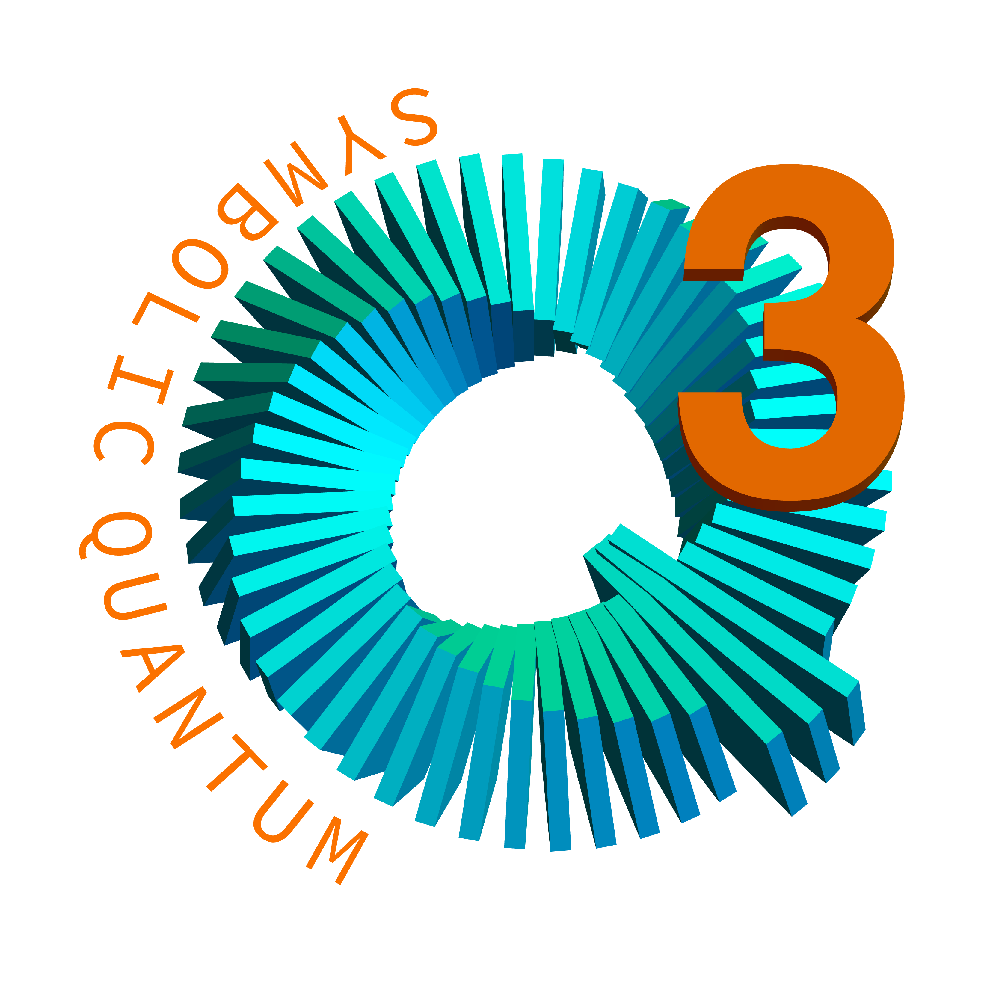

# Q3S: Symbolic Quantum Simulation

Q3S is a symbolic quantum simulation framework written in Wolfram Language to help study *quantum information systems*, *quantum many-body systems*, and *quantum spin systems*; hence the name Q3S. It provides various tools and utilities for symbolic and numerical calculations on these representative quantum systems. It was publically released in 2020.

**_N.B._**: The official name of this Wolfram Language Paclet has been changed to `QauntumMob/Q3S`. To load Q3S, use `Get["QuantumMob/Q3S"]` or `Needs["QuantumMob/Q3S"]`. The primary context is now "QuantumMob`Q3S`" (rather than "Q3`").

## Requirements

Q3S requires *Mathematica v13.1 or later*.

## Installation

Q3S provides a *fully automatic installation and update*. Please take a look at the [Installation Guide](./INSTALL.md) for the instructions.

## YouTube Video Tutorials

[YouTube video tutorials](https://youtube.com/playlist?list=PLO3EQ7RIEy-eW2hPiaPQ24VuVOZytyS5m&feature=shared) of Q3S are available from [here](https://youtube.com/playlist?list=PLO3EQ7RIEy-eW2hPiaPQ24VuVOZytyS5m&feature=shared).

## Quick Start

Once Q3S is installed, put `Q3S` or `QuantumMob/Q3S/guide/Q3S` in the search field of the Wolfram Language Documentation Center (Mathematica Help window) to get users' guides and tutorials on Q3S; see the following screenshots.

## Quantum Computation and Information with Q3S

For more advanced uses of Q3S, take a look at textbook ["A Quantum Computation Workbook" (Springer, March 2022)](https://link.springer.com/book/9783030912130).
A compilation of the Mathematica(R) Notebook files that have been used to generate the demonstrations in this textbook is available from
the [QuantumPlaybook repository](https://github.com/quantum-mob/QuantumPlaybook).

## Quantum Playbook

The [QuantumPlaybook repository](https://github.com/quantum-mob/QuantumPlaybook) provides more demonstrations of various subjects that could not be included in the [Quantum Workbook](https://link.springer.com/book/9783030912130).

## For Beginners of Mathematica

If this is your first time to use Mathematica, this guide written by Stephen Wolfram himself might be a good starting point: [An Elementary Introduction to the Wolfram Language (2nd edition)](https://www.wolfram.com/language/elementary-introduction/2nd-ed/).

## Feedback

Any comment, suggestion, or bug report will be appreciated. Please address it to: [quantum.mob21@gmail.com](mailto:quantum.mob21@gmail.com).

